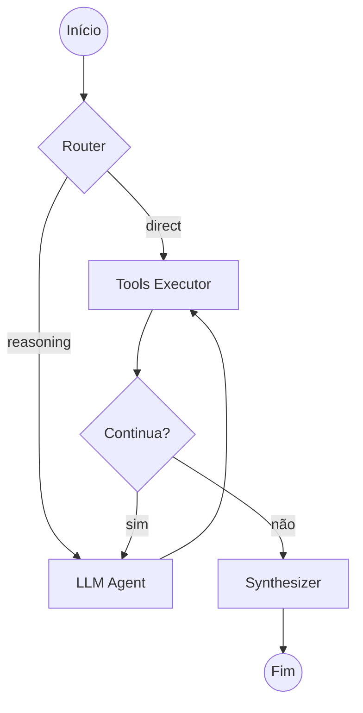

O backend da MomAI é uma aplicação **FastAPI** que gerencia toda a inteligência: inferência de LLM, reconhecimento de voz, orquestração de agentes e sistema de extensões.

## Stack Tecnológica

| Componente           | Tecnologia | Função                                          |
| -------------------- | ---------- | ----------------------------------------------- |
| **API**              | FastAPI    | Endpoints REST e WebSocket                      |
| **Orquestração**     | LangGraph  | Grafo de agentes com estado                     |
| **LLM**              | llama.cpp  | Inferência local (Qwen 3-4B Instruct)           |
| **Embeddings**       | llama.cpp  | Vetorização local (Qwen 3-0.6B Embedding)       |
| **Banco Vetorial**   | LanceDB    | Armazena vetores de intenções e ferramentas     |
| **Banco Relacional** | SQLite     | Configurações, histórico, lembretes             |
| **STT**              | Vosk       | Reconhecimento de fala offline (Speech to Text) |
| **TTS**              | Kokoro-82m | Síntese de voz neural local de alta qualidade   |
| **Extensões**        | pluggy     | Sistema de hooks para plugins                   |

## Modelos de IA

A MomAI utiliza uma arquitetura multi-modelo para garantir eficiência e privacidade. Nenhum dado deixa sua máquina.

### 1. Modelos GGUF (Inferência)

Utilizamos versões quantizadas e otimizadas dos modelos Qwen para rodar em hardware de consumo:

- **Modelo Principal (Chat/Instruct):** `Qwen3-4B-Instruct-2507-Q6_K.gguf`
  - Responsável pelo raciocínio, chat e uso de ferramentas.
  - Formato GGUF Q6_K para balanço entre velocidade e "inteligência".

- **Modelo de Embeddings:** `Qwen3-Embedding-0.6B-Q8_0.gguf`
  - Converte texto e ferramentas em vetores numéricos.
  - Usado pelo sistema de Roteamento Semântico e LanceDB.

### 2. Modelos de Voz (Áudio)

A interface de voz é composta por dois sistemas distintos e locais:

- **Speech-to-Text (Ouvido):** **Vosk**
  - Modelo: `vosk-model-small-pt-0.3`
  - Função: Detectar a "Wake Word" ("Sistema") e transcrever o que você fala para texto. Leve e rápido.

- **Text-to-Speech (Fala):** **Kokoro-82m**
  - Modelo: `kokoro-v0_19.onnx` (82 milhões de parâmetros)
  - Função: Sintetizar a resposta da IA em áudio natural.
  - Roda localmente via ONNX Runtime, oferecendo vozes extremamente realistas com latência mínima.

## Estrutura de Diretórios

```
apps/core/
├── main.py              # Ponto de entrada
├── ai/
│   ├── orchestrator.py  # Orquestrador LangGraph
│   ├── embeddings.py    # Modelo de embeddings
│   ├── graph/           # Definição do grafo de agentes
│   └── providers/       # Provedores de LLM
├── database/
│   ├── models.py        # Schemas SQLite
│   └── vector_db.py     # Interface LanceDB
├── services/
│   ├── extensions/      # Gerenciador de extensões
│   ├── reminders/       # Sistema de lembretes
│   ├── voice/           # STT e Wake Word
│   └── system/          # Info de hardware
├── tools/               # Ferramentas do núcleo
├── agents/
│   ├── builtin/         # Agentes nativos
│   └── extensions/      # Agentes de extensões
└── models/              # Arquivos GGUF
```

## Fluxo de Inicialização

Quando o backend inicia, executa na ordem:

<Steps>
  <Step title="Migrations">
    Valida e atualiza o schema do SQLite (`momai.db`).
  </Step>

<Step title="Carregamento de Extensões">
  O `ExtensionManager` varre pastas de extensões e carrega manifestos.
</Step>

<Step title="Indexação Vetorial">
  Ferramentas e intenções são vetorizadas e indexadas no LanceDB.
</Step>

<Step title="Motor de Voz">
  Vosk é inicializado com o modelo português para wake word e STT.
</Step>

<Step title="FortScript Monitor">
  Inicia monitoramento de processos para detectar jogos/apps pesados.
</Step>

  <Step title="Servidor FastAPI">
    API HTTP e WebSocket prontos para conexões.
  </Step>
</Steps>

## Grafo de Agentes (LangGraph)

O LangGraph permite criar fluxos de IA com estado e ciclos de decisão:



```python
from langgraph.graph import StateGraph

graph = StateGraph(AgentState)

# Nós do grafo
graph.add_node("router", router_node)
graph.add_node("agent", agent_node)
graph.add_node("tools", tool_executor_node)
graph.add_node("synthesizer", synthesizer_node)

# Conexões condicionais
graph.add_conditional_edges(
    "router",
    decide_next_node,
    {"direct": "tools", "reasoning": "agent"}
)

graph.add_edge("agent", "tools")
graph.add_conditional_edges(
    "tools",
    should_continue,
    {"continue": "agent", "end": "synthesizer"}
)
```

### Persistência de Estado

O estado do grafo é salvo em SQLite via `AsyncSqliteSaver`:

```python
from langgraph.checkpoint.sqlite import AsyncSqliteSaver

checkpointer = AsyncSqliteSaver("checkpoints.db")
graph = graph.compile(checkpointer=checkpointer)
```

<Info>
  Isso permite que a MomAI mantenha contexto entre mensagens e sobreviva a
  reinicializações.
</Info>

## Sistema de Extensões

Extensões usam o framework **pluggy** para registrar hooks:

```python
# Definição do hook (núcleo)
class ExtensionSpec:
    @hookspec
    def register_tools(self):
        """Retorna lista de ferramentas LangChain."""

    @hookspec
    def register_intents(self):
        """Retorna lista de intenções para roteamento."""

# Implementação (extensão)
@hookimpl
def register_tools():
    return [minha_ferramenta]

@hookimpl
def register_intents():
    return ["minha intenção customizada"]
```

O `ExtensionManager` é responsável por:

- Carregar manifestos (`manifest.json`)
- Validar permissões declaradas vs código
- Registrar ferramentas no LanceDB
- Injetar itens na sidebar do frontend

## Endpoints Principais

| Endpoint         | Método    | Descrição                                       |
| ---------------- | --------- | ----------------------------------------------- |
| `/chat/stream`   | POST      | Enviar mensagem e receber resposta em streaming |
| `/ws`            | WebSocket | Conexão bidirecional para eventos em tempo real |
| `/system/status` | GET       | Telemetria de hardware                          |
| `/setup/status`  | GET       | Verificar status dos motores (LLM, TTS)         |
| `/reminders`     | GET/POST  | CRUD de lembretes                               |
| `/extensions`    | GET       | Listar extensões instaladas                     |

## Motor de Voz

O sistema de voz é composto por:

<Tabs>
  <Tab title="Wake Word">
    Usa Vosk em modo contínuo para detectar **"Sistema"**:
    ```python
    # Modelo leve sempre ativo
    recognizer = KaldiRecognizer(model, 16000)
    while True:
        data = stream.read(4000)
        if recognizer.AcceptWaveform(data):
            result = json.loads(recognizer.Result())
            if "Loki" in result["text"].lower():
                activate_assistant()
    ```
  </Tab>
  <Tab title="STT Completo">
    Após ativação, captura a frase completa:
    ```python
    # Captura até silêncio
    audio_buffer = []
    while not silence_detected:
        audio_buffer.append(stream.read(4000))

    # Transcrição completa
    text = transcribe(audio_buffer)
    ```

  </Tab>
</Tabs>

## Próximos Passos

<Columns cols={2}>
  <Card
    title="Arquitetura Frontend"
    icon="desktop"
    href="/pt-BR/arquitetura/frontend"
  >
    Entenda a interface React.
  </Card>
  <Card
    title="Criar Extensões"
    icon="puzzle-piece"
    href="/pt-BR/extensoes/conceitos"
  >
    Desenvolva suas próprias extensões.
  </Card>
</Columns>
