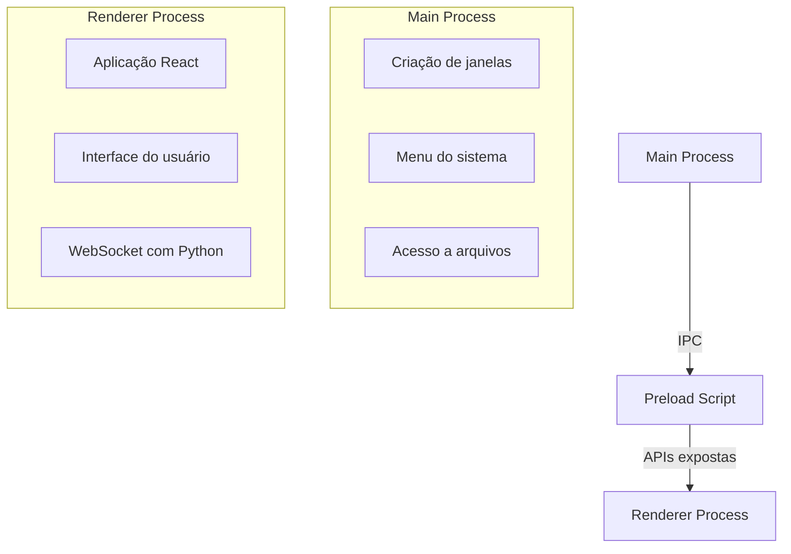

O frontend da MomAI é uma aplicação **Electron** que utiliza **React 19** para a interface de usuário. Ele se conecta ao backend via WebSocket para streaming de respostas em tempo real.

## Stack Tecnológica

| Componente      | Tecnologia   | Função                         |
| --------------- | ------------ | ------------------------------ |
| **Container**   | Electron     | Acesso a APIs nativas do SO    |
| **UI**          | React 19     | Componentes de interface       |
| **Estilo**      | Tailwind CSS | Sistema de design tokens       |
| **Build**       | Vite         | Dev server e bundling          |
| **Estado**      | Zustand      | Gerenciamento de estado global |
| **Comunicação** | WebSocket    | Streaming de tokens e eventos  |

## Estrutura de Diretórios

```
apps/desktop/
├── electron.vite.config.ts   # Configuração Vite para Electron
├── src/
│   ├── main/                 # Processo principal Electron
│   │   └── index.ts          # Criação de janela, IPC
│   ├── preload/              # Bridge entre main e renderer
│   │   └── index.ts          # APIs expostas ao React
│   └── renderer/             # Aplicação React
│       ├── App.tsx           # Componente raiz
│       ├── components/       # Componentes reutilizáveis
│       ├── hooks/            # Custom hooks
│       ├── stores/           # Estado Zustand
│       └── views/            # Páginas/Views
├── resources/                # Assets (ícones, etc.)
└── build/                    # Configuração de build
```

## Arquitetura de Processos

O Electron divide a aplicação em três processos:



## Sistema de Renderização Dinâmica

A MomAI pode renderizar componentes que "não conhece" ainda, graças a extensões:

### MainViewRenderer

Atua como roteador dinâmico de componentes:

```tsx
function MainViewRenderer({ activeView }: Props) {
  // Componentes nativos
  const builtinViews = {
    chat: ChatView,
    settings: SettingsView,
    reminders: RemindersView,
  };

  // Componentes de extensões (carregados dinamicamente)
  const extensionViews = useExtensionViews();

  const View = builtinViews[activeView] || extensionViews[activeView];

  return View ? <View /> : <NotFound />;
}
```

### GraphInterface

Renderiza interfaces dinâmicas enviadas pelo orquestrador:

```tsx
function GraphInterface({ schema }: Props) {
  // Schema JSON define o que renderizar
  // Exemplo: { type: "table", data: [...], actions: [...] }

  switch (schema.type) {
    case "table":
      return <DynamicTable {...schema} />;
    case "form":
      return <DynamicForm {...schema} />;
    case "confirmation":
      return <ConfirmationDialog {...schema} />;
  }
}
```

<Info>
  Quando o usuário interage com um componente dinâmico, o evento é enviado de
  volta ao LangGraph para continuar o fluxo.
</Info>

## Hooks Customizados

### useChat

Centraliza toda lógica de chat:

```tsx
const {
  messages, // Histórico de mensagens
  isLoading, // Aguardando resposta
  send, // Enviar mensagem
  tokens, // Tokens em streaming
  currentTool, // Ferramenta sendo executada
} = useChat();
```

### useStatus

Gerencia estado de saúde do sistema:

```tsx
const {
  isModelLoaded, // LLM pronto
  isVoiceActive, // Wake word ativo
  cpu, // Uso de CPU %
  ram, // Uso de RAM %
  gpu, // Uso de VRAM %
} = useStatus();
```

### useExtensions

Acesso às extensões instaladas:

```tsx
const {
  extensions, // Lista de extensões
  sidebarItems, // Itens para sidebar
  isLoading, // Carregando extensões
} = useExtensions();
```

## Comunicação WebSocket

O hook `useWebSocket` gerencia a conexão:

```tsx
function useWebSocket() {
  const socket = useRef<WebSocket>();

  useEffect(() => {
    socket.current = new WebSocket("ws://localhost:8000/ws");

    socket.current.onmessage = (event) => {
      const data = JSON.parse(event.data);

      switch (data.type) {
        case "chat.token":
          appendToken(data.token);
          break;
        case "tool.start":
          setCurrentTool(data.tool);
          break;
        case "system.status":
          updateStatus(data.status);
          break;
      }
    };
  }, []);
}
```

## Sistema de Temas

Tailwind CSS com design tokens permite temas dinâmicos:

```css
/* index.css */
:root {
  --color-primary: #6366f1;
  --color-background: #ffffff;
  --color-text: #1f2937;
}

.dark {
  --color-background: #111827;
  --color-text: #f3f4f6;
}
```

```tsx
// Componente usa variáveis CSS
<button className="bg-primary text-white">Enviar</button>
```

## Desenvolvimento

<Tabs>
  <Tab title="Dev Server">
    ```bash
    cd apps/desktop
    pnpm run dev
    ```
    Hot Module Replacement ativo. Alterações no React recarregam instantaneamente.
  </Tab>
  <Tab title="DevTools">
    Dentro do Electron, pressione `Ctrl+Shift+I` para abrir o DevTools do
    Chrome. Útil para:
    - Inspecionar componentes React
    - Monitorar tráfego WebSocket
    - Debug de extensões
  </Tab>
  <Tab title="Build">
    ```bash
    # Build para produção
    pnpm run build

    # Gerar instalador
    pnpm run dist
    ```

  </Tab>
</Tabs>

## Próximos Passos

<Columns cols={2}>
  <Card
    title="Sistema de Extensões"
    icon="puzzle-piece"
    href="/pt-BR/extensoes/conceitos"
  >
    Entenda como criar plugins.
  </Card>
  <Card title="Contribuir" icon="code-branch" href="/pt-BR/contribuindo">
    Ajude a melhorar o frontend.
  </Card>
</Columns>
