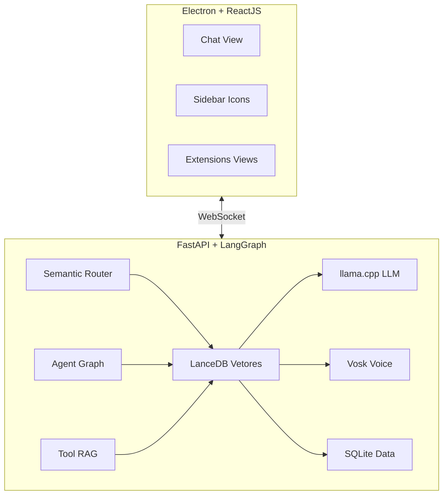
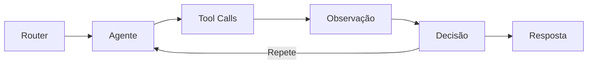

## Arquitetura de Alto Nível

A MomAI é composta por dois processos principais que se comunicam via WebSocket:

## Fluxo de Processamento

<Steps>
  <Step title="Entrada">
    O usuário envia uma mensagem (texto ou voz convertida para texto pelo Vosk).
  </Step>

<Step title="Roteamento Semântico">
  A mensagem é vetorizada e comparada contra intenções conhecidas no LanceDB: 
  - **Match direto:** Executa a ferramenta correspondente sem usar o LLM 
  - **Sem match:** Encaminha para o Grafo de Agentes
</Step>

<Step title="Processamento">
  Se necessário, o LangGraph orquestra: 
  1. Seleciona o agente apropriado 
  2. Carrega ferramentas relevantes (Tool RAG) 
  3. Executa ciclos de raciocínio 
  4. Sintetiza a resposta final
</Step>

  <Step title="Resposta">
    O resultado é enviado via WebSocket para o frontend, que exibe em streaming
    e opcionalmente converte para voz.
  </Step>
</Steps>

## Componentes Principais

### Semantic Router

O roteador semântico é a primeira linha de processamento. Ele:

- Vetoriza a entrada do usuário usando modelo de embeddings local
- Compara contra intenções pré-indexadas no LanceDB
- Decide se o comando pode ser executado diretamente ou precisa do LLM

<Info>
  Comandos como "criar lembrete para amanhã" são executados instantaneamente sem
  chamar o LLM, economizando tempo e recursos.
</Info>

### LangGraph (Grafo de Agentes)

Para tarefas complexas, o LangGraph gerencia um ciclo de decisão:

O grafo permite:

- **Ciclos de raciocínio:** O agente pode chamar várias ferramentas antes de responder
- **Estado persistente:** O contexto é mantido entre mensagens
- **Checkpoints:** Estado salvo em SQLite para recuperação

### Tool RAG

Em vez de passar todas as ferramentas disponíveis para o LLM (o que gastaria muitos tokens), a MomAI usa RAG para selecionar apenas as ferramentas relevantes:

1. A descrição de cada ferramenta é vetorizada e indexada
2. Quando o agente precisa de ferramentas, busca as mais relevantes no LanceDB
3. Apenas 3-5 ferramentas são passadas para o LLM por vez

<Tip>
  Isso permite ter centenas de extensões instaladas sem impactar a performance.
</Tip>

## Persistência de Dados

| Banco              | Tecnologia | Conteúdo                            |
| ------------------ | ---------- | ----------------------------------- |
| **momai.db**       | SQLite     | Configurações, lembretes, histórico |
| **checkpoints.db** | SQLite     | Estado dos agentes LangGraph        |
| **lancedb/**       | LanceDB    | Vetores de intenções e ferramentas  |

## Comunicação WebSocket

O WebSocket transporta eventos bidirecionais:

<Tabs>
  <Tab title="Frontend → Backend">
    - `chat.message` - Mensagem do usuário - `voice.start` - Início de captura
    de voz - `voice.stop` - Fim de captura de voz - `extension.action` - Ação de
    extensão
  </Tab>
  <Tab title="Backend → Frontend">
    - `chat.token` - Token de streaming da resposta - `chat.complete` - Resposta
    completa - `tool.start` - Ferramenta sendo executada - `tool.complete` -
    Resultado da ferramenta - `system.status` - Telemetria (CPU, RAM, etc.)
  </Tab>
</Tabs>

## Próximos Passos

<Columns cols={2}>
  <Card
    title="Detalhes do Backend"
    icon="server"
    href="/pt-BR/arquitetura/backend"
  >
    Aprofunde-se na arquitetura Python.
  </Card>
  <Card
    title="Detalhes do Frontend"
    icon="desktop"
    href="/pt-BR/arquitetura/frontend"
  >
    Entenda a interface React.
  </Card>
</Columns>
