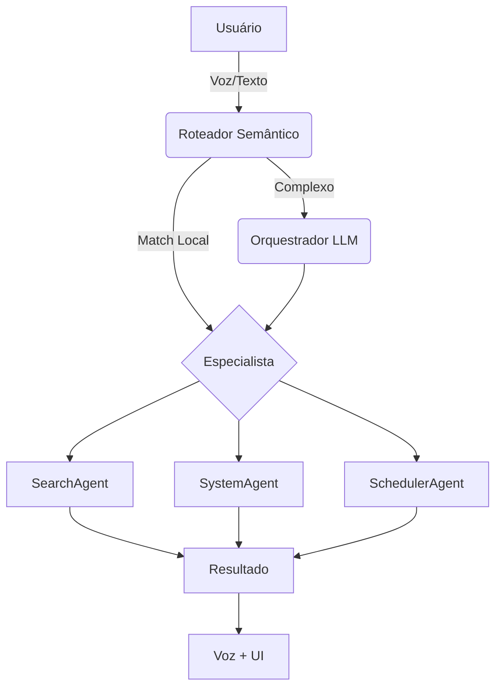
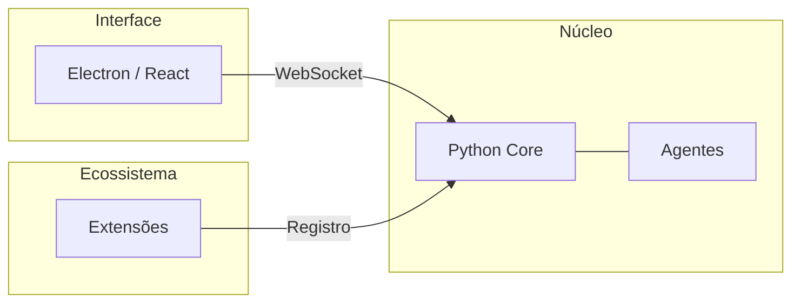

## O Problema: Inteligência Burra

Temos LLMs incríveis que conseguem explicar física quântica, mas que não sabem:
- Que o arquivo que eu baixei agora há pouco está na pasta `Downloads`.
- Que eu tenho uma reunião daqui a 5 minutos e meu computador está fazendo um update pesado.
- Que eu respondo a mesma mensagem de "Ok, obrigado" dez vezes por dia.

A tecnologia existe, mas ela está trancada em abas de navegador. O MomAI existe para trazer essa inteligência para o **nível do sistema**.

## A Frustração do Usuário Comum

A motivação do projeto vem de tarefas reais, chatas e repetitivas:

1.  **Silo de Dados**: Por que eu tenho que subir meus extratos bancários para o servidor da OpenAI para que ela me ajude a categorizar gastos?
2.  **Falta de Proatividade**: Lembretes de celular são fáceis de ignorar. Um assistente que te fala (literalmente) "Ei, você tem aula agora" enquanto você está distraído jogando ou trabalhando é muito mais eficaz.
3.  **Contexto Local**: IAs de nuvem não têm contexto do seu hardware. Elas não sabem se sua RAM está acabando ou se sua GPU está livre para processar algo.

## Por que Local-First?

Existem três pilares que tornam o processamento local a única escolha real para um assistente pessoal:

### 1. Soberania de Dados
Seus arquivos, suas conversas e sua rotina são seus. No momento em que você integra um assistente com seu sistema de arquivos, a nuvem deixa de ser uma opção segura para a maioria das pessoas.

### 2. Latência de Voz
Para que uma conversa por voz pareça natural, a resposta precisa ser rápida. O tempo de enviar áudio para a nuvem, processar e devolver é o suficiente para quebrar a imersão. Processando a palavra-chave e o TTS localmente, chegamos perto da resposta instantânea.

### 3. Custo e Independência
Modelos locais não têm mensalidade e não param de funcionar se a empresa mudar a API ou se sua internet cair. Se você tem uma GPU, você tem um cérebro digital gratuito.

## O "Sonho" vs A Realidade

Muitos projetos de IA vendem um "JARVIS" completo. A realidade do MomAI é um **núcleo extensível**. 

Nós não vamos criar todas as automações do mundo. Vamos criar a infraestrutura (Agentes, Roteador Semântico, Tool RAG) para que **você** ou a comunidade adicione a peça que falta para a sua vida — seja baixar mangás automaticamente, controlar o Spotify ou organizar os PDFs da faculdade.

## Como isso funciona na prática?

MomAI é uma equipe de especialistas coordenados pelo **LangGraph**:

<AccordionGroup>
  <Accordion title="O que são Agentes?">
    São funcionários virtuais focados. O `SystemAgent` só se preocupa com o seu Windows. O `SearchAgent` só se preocupa com a Web. Isso mantém a IA focada e evita erros.
  </Accordion>
  <Accordion title="O que é o Tool RAG?">
    É como uma caixa de ferramentas infinita. A IA não carrega todas as ferramentas de uma vez. Ela busca apenas o que precisa no momento (ex: "preciso da ferramenta de volume agora"). Isso economiza memória e inteligência.
  </Accordion>
</AccordionGroup>

## Tipos de agentes

**1. Agentes de Delegação** — Você pede, eles fazem.
- **SearchAgent**: Pesquisa na internet
- **SchedulerAgent**: Gerencia lembretes e agenda
- **InterfaceAgent**: Cria gráficos e relatórios

**2. Agentes de Eventos** — Agem sozinhos quando algo acontece.
- **ReminderAgent**: Te avisa quando chega a hora de algo
- **SystemAgent**: Age quando o PC liga ou detecta eventos do sistema

## Eventos: o diferencial

A maioria dos chatbots espera você digitar algo. MomAI age **sozinha** quando detecta gatilhos.

Exemplos que virão por padrão:

- **Agendador**: "Todo dia às 7h me conta as notícias de tech"
- **Ao ligar o PC**: Mostra sua agenda do dia e te dá bom dia
- **Intervalo**: "Me lembra de beber água a cada 2 horas"

Exemplos para extensões futuras:

- **WhatsApp**: Quando alguém manda mensagem, a MomAI pergunta se pode responder
- **Monitoramento de uso**: Passou 2 horas no Instagram? Ela te lembra das tarefas pendentes

## O que você pode fazer com MomAI + Extensões

<CardGroup cols={2}>
  <Card title="Gestão de Conhecimento" icon="book">
    Revisar anotações no Obsidian, criar roadmaps de estudo, resumir notícias.
  </Card>
  <Card title="Controle do Sistema" icon="computer">
    Hibernar, desligar, organizar arquivos, executar scripts.
  </Card>
  <Card title="Automação Pessoal" icon="robot">
    Baixar mangás, responder mensagens padrão, monitorar preços.
  </Card>
  <Card title="Integração com Apps" icon="plug">
    Notion, Google Calendar, Spotify, e qualquer coisa com API.
  </Card>
</CardGroup>

## Sistema de Extensões

O MomAI vem simples de propósito. Instale só o que você precisa.

Algumas extensões planejadas:

| Extensão | O que faz |
|----------|-----------|
| **WhatsApp** | Lê mensagens e sugere respostas (requer Docker) |
| **Abertura de apps** | "Abre o Chrome e o Spotify" |
| **Navegação** | Controla o navegador pra fazer tarefas em sites |
| **Planilhas** | Lê, compara e edita planilhas locais |
| **Notas** | Integra com Obsidian, Notion, Anytype |

## Extensões da comunidade

Quer criar sua própria extensão? Clone o modelo de exemplo, adapte pro seu caso, e faça um PR no arquivo `community-plugins.json`.

A extensão que você criar ajuda todo mundo que usa MomAI.

## Por que Python?

- Melhor ecossistema pra IA (LangChain, LangGraph)
- Fácil de processar áudio (voz pra texto, texto pra voz)
- Curva de aprendizado suave pra quem quer criar extensões

## Inspirações

- [Vocalis](https://github.com/shaakz/vocalis) — Inspiração pra conversa por voz
- [Obsidian](https://obsidian.md/) — Modelo de plugins da comunidade
- [Eduardo Mendes (Dunossauro)](https://www.youtube.com/@Dunossauro) — Influenciou as escolhas técnicas

## Próximos passos

<CardGroup cols={2}>
  <Card title="Configurar Backend" icon="server" href="/pt-BR/backend">
    Coloque o núcleo pra rodar.
  </Card>
  <Card title="Como Colaborar" icon="code-branch" href="/pt-BR/como-colaborar">
    Ajude a construir o futuro da MomAI.
  </Card>
</CardGroup>
