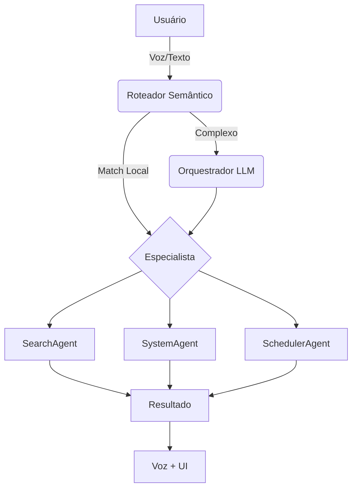
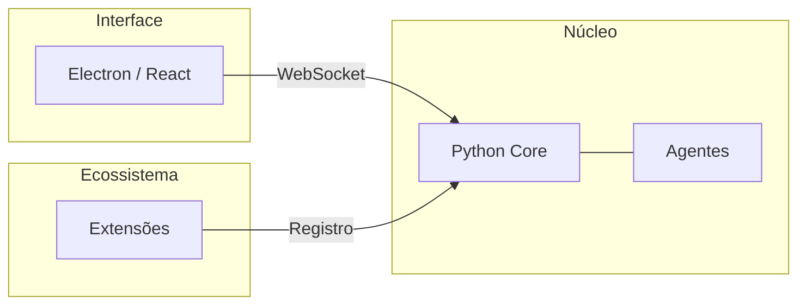

## Limitações da Tecnologia Atual

Temos LLMs excelentes capazes de explicar temas complexos, mas que frequentemente:

- Não entendem o contexto em que você se encontra nem suas preferências locais
- Não conseguem interagir com as ferramentas que você usa no dia a dia
- Exigem que você envie dados sensíveis para a nuvem

A tecnologia existe, mas está focada em produtividade corporativa ou pesquisa técnica. A MomAI existe para trazer essa inteligência para sua **vida pessoal**, como uma companheira que cresce e ganha funcionalidades através de extensões conforme suas necessidades.

## Pessoas, não Usuários

Diferente de frameworks de agentes feitos para desenvolvedores criarem automações empresariais, a MomAI é feita para **você**. O objetivo não é vender uma plataforma de IA, mas disponibilizar uma ferramenta que torne seu dia a dia mais fluido.

Se você usa o computador para estudar, jogar ou trabalhar, a MomAI não quer ser um "terminal" onde você digita comandos, mas uma presença que te ajuda a gerenciar o caos digital sem que você precise ser um expert em tecnologia.

## A Frustração do Usuário Comum

A motivação do projeto vem de tarefas reais, chatas e repetitivas:

1. **Privacidade da Rotina**: Para que uma IA ajude na sua organização pessoal, ela precisa conhecer seus horários e hábitos. Enviar todos esses detalhes para servidores externos deixa sua privacidade vulnerável.
2. **Falta de Proatividade**: Lembretes de celular são fáceis de ignorar. Um assistente que te fala (literalmente) "Ei, você tem aula agora" enquanto você está distraído jogando ou trabalhando é muito mais eficaz.

## Por que Local-First?

### Soberania de Dados

Seus arquivos, conversas e rotina são bens valiosos. Ao processar dados localmente, você elimina o risco de vazamentos em infraestruturas de terceiros. A base do projeto é garantir que o processamento local seja sempre uma opção viável e segura.

## O "Sonho" vs A Realidade

Muitos projetos de IA vendem um "JARVIS" completo. A realidade da MomAI é um **núcleo extensível**.

MomAI não possui na sua loja de extensões todas as automações do mundo. Ela oferece a infraestrutura (Agentes, Roteador Semântico, Tool RAG) para que **você** ou a comunidade adicione as funcionalidades necessárias — seja organizar arquivos, controlar aplicativos ou gerenciar documentos da faculdade.

## Como isso funciona na prática?

MomAI é uma equipe de especialistas coordenados pelo **LangGraph**:

<AccordionGroup>
  <Accordion title="O que são Agentes?">
    São especialistas virtuais focados. O `SystemAgent` gerencia apenas seu
    sistema operacional. O `SearchAgent` cuida apenas de buscas na web. Isso mantém a IA focada e
    reduz erros.
  </Accordion>
  <Accordion title="O que é o Tool RAG?">
    É como uma caixa de ferramentas inteligente. A IA não carrega todas as
    ferramentas de uma vez. Ela busca apenas o que precisa no momento (ex:
    "preciso da ferramenta de volume agora"). Isso economiza memória e otimiza o
    processo.
  </Accordion>
</AccordionGroup>

## Tipos de Agentes

**1. Agentes de Delegação** — Você pede, eles fazem.

- **SearchAgent**: Pesquisa na internet
- **SchedulerAgent**: Gerencia lembretes e agenda
- **InterfaceAgent**: Cria gráficos e relatórios

**2. Agentes de Eventos** — Agem sozinhos quando algo acontece.

- **ReminderAgent**: Te avisa quando chega a hora
- **SystemAgent**: Age quando o PC liga ou detecta eventos do sistema

## Eventos: O Diferencial

A maioria dos chatbots espera você digitar algo. MomAI age **proativamente** quando detecta gatilhos.

Exemplos que virão por padrão:

- **Agendador**: "Todo dia às 7h me conta as notícias de tech"
- **Ao ligar o PC**: Mostra sua agenda do dia e te dá bom dia
- **Intervalo**: "Me lembra de beber água a cada 2 horas"

Exemplos para extensões futuras:

- **WhatsApp**: Quando alguém manda mensagem, a MomAI pergunta se pode responder
- **Monitoramento de uso**: Passou 2 horas no Instagram? Ela te lembra das tarefas pendentes

## Extensões da Comunidade

Quer criar sua própria extensão? Clone o modelo de exemplo, adapte para seu caso e faça um PR no arquivo `community-plugins.json`.

A extensão que você criar ajuda toda a comunidade MomAI.

## Por que Python?

- Melhor ecossistema para IA (LangChain, LangGraph)
- Fácil processamento de áudio (voz para texto, texto para voz)
- Curva de aprendizado suave para criação de extensões

## Inspirações

- [Vocalis](https://github.com/shaakz/vocalis) — Inspiração para conversa por voz
- [Obsidian](https://obsidian.md/) — Modelo de plugins da comunidade

Um agradecimento especial ao **Eduardo Mendes (Dunossauro)**. Embora não faça parte do projeto, seus conteúdos de alta qualidade sobre Python foram fundamentais para as decisões técnicas e para a construção da base de conhecimento necessária para desenvolver a MomAI.

## Próximos Passos

<CardGroup cols={2}>
  <Card title="Configurar Backend" icon="server" href="/pt-BR/backend">
    Coloque o núcleo para rodar.
  </Card>
  <Card title="Como Colaborar" icon="code-branch" href="/pt-BR/como-colaborar">
    Ajude a construir o futuro da MomAI.
  </Card>
</CardGroup>
