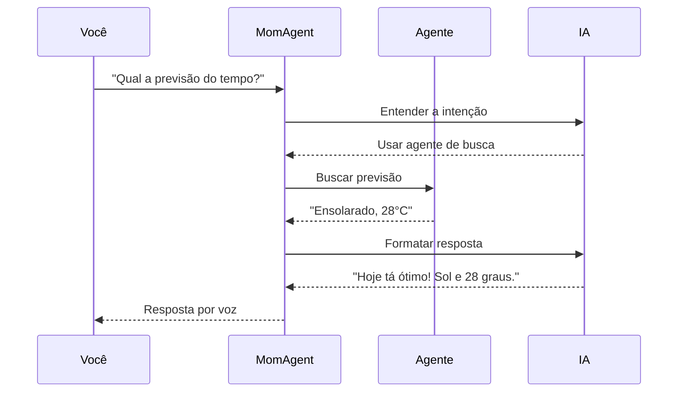
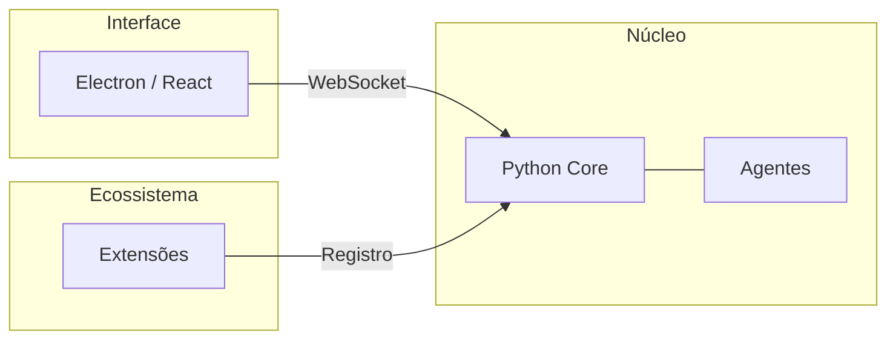

## As pequenas frustrações

Todo mundo fala de IA revolucionando o mundo. Mas no meu dia a dia, eu ainda:

- **Comparo planilhas na mão** porque ninguém fez uma ferramenta simples pra isso
- **Respondo "sim" ou "não"** no WhatsApp pra mesma pessoa, todo dia, sobre a mesma coisa
- **Esqueço de beber água** porque o lembrete some no meio de outras notificações
- **Perco prazos da faculdade** porque estão espalhados em 3 sistemas diferentes
- **Quero ler mangás offline** mas preciso baixar um por um, manualmente

E o mais frustrante: **a tecnologia pra resolver tudo isso já existe**.

Existem MCPs que conectam com qualquer coisa. APIs pra tudo. Modelos de IA que entendem linguagem natural. Mas tudo isso serve pra criar programas isolados. Ninguém juntou as peças num único lugar que funcione pra **minha vida**.

## O sonho

Imagina o seguinte cenário:

Você acorda. Seu computador já ligou sozinho (Wake-on-LAN). Quando você senta pra tomar café, uma voz diz:

> *"Bom dia! Você tem 3 coisas pra hoje: entregar o trabalho de cálculo até 23h59, reunião às 14h, e o lixo reciclável é amanhã. Ah, sua mãe mandou mensagem perguntando se você almoçou. Quer que eu responda?"*

Você diz "responde que sim" e continua tomando café.

Duas horas depois:

> *"Ei, você não bebe água há um tempão. Vai lá."*

À noite, você abre o app de leitura e os últimos capítulos dos seus mangás já estão lá, baixados automaticamente.

**Isso é o que MomAI quer ser.**

## Como isso funciona?

MomAI é construída como uma equipe de agentes. Pense numa empresa:

- **MomAgent** é o gerente. Recebe seu pedido e decide quem resolve.
- **Agentes especializados** fazem o trabalho: um busca na internet, outro cria lembretes, outro gerencia arquivos.

<AccordionGroup>
  <Accordion title="O que são Agentes?">
    São como funcionários virtuais. Cada um sabe fazer uma coisa: buscar na internet, criar lembretes, enviar mensagens. O MomAgent coordena todos.
  </Accordion>
  <Accordion title="O que são Ferramentas (Tools)?">
    São as capacidades de cada agente. Por exemplo: abrir sites, ler arquivos, fazer cálculos, enviar dados pra uma API.
  </Accordion>
  <Accordion title="O que é MCP?">
    Model Context Protocol. Um padrão que permite conectar a MomAI com qualquer aplicativo (Notion, e-mail, calendário) sem criar integração específica pra cada um.
  </Accordion>
</AccordionGroup>

## Tipos de agentes

**1. Agentes de Delegação** — Você pede, eles fazem.
- **SearchAgent**: Pesquisa na internet
- **SchedulerAgent**: Gerencia lembretes e agenda
- **InterfaceAgent**: Cria gráficos e relatórios

**2. Agentes de Eventos** — Agem sozinhos quando algo acontece.
- **ReminderAgent**: Te avisa quando chega a hora de algo
- **SystemAgent**: Age quando o PC liga ou detecta eventos do sistema

## Eventos: o diferencial

A maioria dos chatbots espera você digitar algo. MomAI age **sozinha** quando detecta gatilhos.

Exemplos que virão por padrão:

- **Agendador**: "Todo dia às 7h me conta as notícias de tech"
- **Ao ligar o PC**: Mostra sua agenda do dia e te dá bom dia
- **Intervalo**: "Me lembra de beber água a cada 2 horas"

Exemplos para extensões futuras:

- **WhatsApp**: Quando alguém manda mensagem, a MomAI pergunta se pode responder
- **Monitoramento de uso**: Passou 2 horas no Instagram? Ela te lembra das tarefas pendentes

## O que você pode fazer com MomAI + Extensões

<CardGroup cols={2}>
  <Card title="Gestão de Conhecimento" icon="book">
    Revisar anotações no Obsidian, criar roadmaps de estudo, resumir notícias.
  </Card>
  <Card title="Controle do Sistema" icon="computer">
    Hibernar, desligar, organizar arquivos, executar scripts.
  </Card>
  <Card title="Automação Pessoal" icon="robot">
    Baixar mangás, responder mensagens padrão, monitorar preços.
  </Card>
  <Card title="Integração com Apps" icon="plug">
    Notion, Google Calendar, Spotify, e qualquer coisa com API.
  </Card>
</CardGroup>

## Sistema de Extensões

O MomAI vem simples de propósito. Instale só o que você precisa.

Algumas extensões planejadas:

| Extensão | O que faz |
|----------|-----------|
| **WhatsApp** | Lê mensagens e sugere respostas (requer Docker) |
| **Abertura de apps** | "Abre o Chrome e o Spotify" |
| **Navegação** | Controla o navegador pra fazer tarefas em sites |
| **Planilhas** | Lê, compara e edita planilhas locais |
| **Notas** | Integra com Obsidian, Notion, Anytype |

## Extensões da comunidade

Quer criar sua própria extensão? Clone o modelo de exemplo, adapte pro seu caso, e faça um PR no arquivo `community-plugins.json`.

A extensão que você criar ajuda todo mundo que usa MomAI.

## Por que Python?

- Melhor ecossistema pra IA (LangChain, LangGraph)
- Fácil de processar áudio (voz pra texto, texto pra voz)
- Curva de aprendizado suave pra quem quer criar extensões

## Inspirações

- [Vocalis](https://github.com/shaakz/vocalis) — Inspiração pra conversa por voz
- [Obsidian](https://obsidian.md/) — Modelo de plugins da comunidade
- [Eduardo Mendes (Dunossauro)](https://www.youtube.com/@Dunossauro) — Influenciou as escolhas técnicas

## Próximos passos

<CardGroup cols={2}>
  <Card title="Configurar Backend" icon="server" href="/pt-BR/backend">
    Coloque o núcleo pra rodar.
  </Card>
  <Card title="Como Colaborar" icon="code-branch" href="/pt-BR/como-colaborar">
    Ajude a construir o futuro da MomAI.
  </Card>
</CardGroup>
