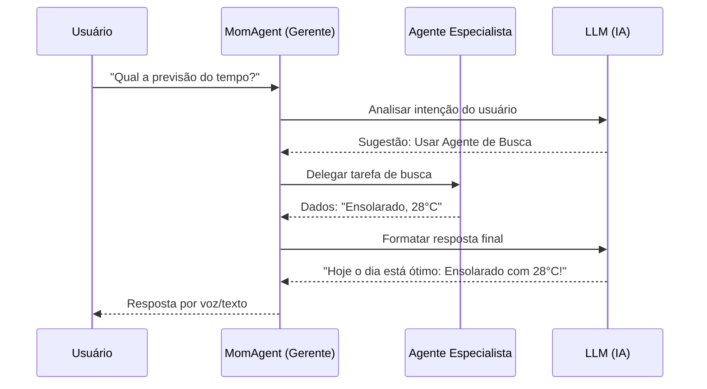
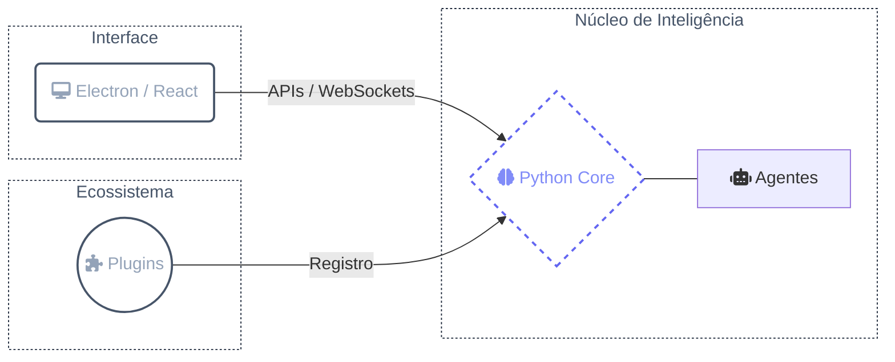

## Propósito

MomAI será um assistente virtual opensource com suporte planejado para Windows, Linux e Mac. O projeto está em desenvolvimento e tem como objetivo:

- Captar informações e armazená-las localmente no seu computador
- Executar tarefas automaticamente quando algo específico acontecer
- Criar lembretes que avisam você no horário certo (por voz e notificação)
- Responder a comandos de voz
- Se conectar a outros aplicativos e serviços através de extensões

<Warning>
  Por padrão, os dados são armazenados localmente e processados pelos provedores de LLM. Cabe ao usuário escolher quais provedores utilizar.  
  A MomAI possui uma extensão própria que adiciona o `llama.cpp`, permitindo baixar modelos locais e executá-los diretamente na assistente.  
  No entanto, você também pode optar por usar chaves de API de terceiros.

  Extensões podem enviar ou receber informações de serviços externos.  
  Antes de adicionar uma nova extensão, revise as permissões às quais ela terá acesso e certifique-se de que você concorda com os riscos envolvidos.
</Warning>

### Como vai funcionar?

MomAI será construída como uma equipe de agentes especializados. Pense como uma empresa organizada:

- **MomAgent** será o "gerente" principal que recebe seu pedido e decide qual agente especializado deve executá-lo.
- **Agentes Especializados** cuidarão de tarefas específicas (buscar na internet, criar lembretes, gerenciar interfaces, etc).

Quando você falar algo, o MomAgent vai analisar a intenção e delegar para o agente mais adequado. É um sistema modular onde cada agente é um especialista em sua função.

Cada agente terá suas próprias ferramentas de trabalho - conexões com sites, aplicativos e serviços. Você poderá adicionar novos agentes através de extensões.

<AccordionGroup>
  <Accordion title="Agentes (Agents)">
    São como "funcionários virtuais" especializados. Cada um tem uma função específica: alguns fazem buscas na internet, outros criam lembretes, e assim por diante. O MomAgent é o "gerente" que coordena todos eles.
  </Accordion>
  <Accordion title="Ferramentas (Tools)">
    São as capacidades que cada agente tem para fazer seu trabalho. Por exemplo: abrir sites, enviar mensagens, criar arquivos, fazer cálculos.
  </Accordion>
  <Accordion title="MCP (Model Context Protocol)">
    Um protocolo padrão que permite o MomAI se conectar facilmente com diferentes aplicativos e serviços (como seu bloco de notas, e-mail, etc.) sem precisar criar uma integração única para cada um.
  </Accordion>
  <Accordion title="Provedor de IA (LLM Provider)">
    É o "cérebro" que dá inteligência aos agentes. Você poderá escolher usar: um modelo que roda localmente (via llama.cpp) ou serviços online como Google AI Studio e Groq.
  </Accordion>
</AccordionGroup>

### Fluxo de Funcionamento

### Tipos de Agentes

1. **Agentes de Delegação**: Acionados pelo MomAgent quando você faz um pedido direto.
   - **InterfaceAgent**: Cria telas, gráficos e relatórios organizados.
   - **SchedulerAgent**: Gerencia seus agendamentos e lembretes.
   - **SearchAgent**: Realiza pesquisas e traz resultados da internet.

2. **Agentes de Eventos (Autônomos)**: 
   São ativados automaticamente por gatilhos do sistema, sem precisar de um comando direto.
   - **ReminderAgent**: Avisa você por voz quando chega a hora de um lembrete.
   - **SystemAgent**: Age quando o computador liga ou detecta eventos específicos do Windows/Linux/Mac.

## Um pouco mais sobre eventos

Diferente de um chatbot comum onde você precisa sempre dar comandos, MomAI será capaz de agir sozinha quando detectar que algo aconteceu. Eventos são como "gatilhos automáticos" que fazem a assistente trabalhar sem você precisar pedir.

### Eventos que virão por padrão

1. **Agendador de tarefas** - Você poderá programar tarefas para horários específicos. Exemplos:

   - "Todo dia às 07:00 me conte as notícias de tecnologia"
   - "Me lembre de tomar água a cada 30 minutos"
   - "A cada 12h, verifique o preço daquele produto"

2. **Quando você ligar o computador** - A assistente vai iniciar automaticamente e poderá fazer ações programadas (como te dar bom dia e mostrar sua agenda do dia)

### Alguns eventos planejados para extensões

1. **WhatsApp** - Quando alguém te mandar mensagem, MomAI te avisa e pergunta se pode responder

2. **Monitoramento de uso** - Se você ficar muito tempo em redes sociais ou jogos, a assistente pode te lembrar das tarefas pendentes

## O que você pode fazer com MomAI + Extensões

1. **Gestão de Conhecimento**:
   - Revisar anotações no Notion/Obsidian e criar roadmaps baseados em estudos anteriores.
   - Gerar relatórios de tendências tecnológicas baseados em notícias recentes.
2. **Controle do Sistema**:
   - Controle de energia (hibernar/desligar).
   - Manipulação de arquivos e automação via terminal.
3. **Automação Residencial**:
   - Controle de luzes, ar condicionado e dispositivos IoT conectados.

> Futuramente, o MomAI receberá um aplicativo mobile e terá acesso a ferramentas para controlar o celular pelo PC e controlar o PC pelo celular. Inclusive, é possível, na maioria dos computadores, ligá-lo pelo próprio celular usando Wake-on-LAN. Para maior segurança, o aplicativo se conectará apenas a um WebSocket fornecido pela instância local do FastAPI.

## Por que Python?

Python é a escolha ideal para IA e automação devido ao ecossistema robusto:
- Suporte nativo para bibliotecas como LangChain e LangGraph.
- Facilidade em processamento de áudio (STT/TTS).
- Rapidez no desenvolvimento de extensões.

## Sistema de Extensões

O diferencial do MomAI será permitir que você escolha quais "poderes" sua assistente terá. Como algumas funcionalidades podem ocupar muito espaço e processamento, apenas o essencial virá instalado por padrão.

Você poderá instalar extensões para adicionar novas capacidades conforme sua necessidade. Algumas extensões planejadas:

### WhatsApp

Uma integração experimental do MomAI com o Whatsapp. Nota: Devido à complexidade de infraestrutura (Docker/API), esta extensão é recomendada para usuários avançados.

**Requisitos**

- Docker desktop
- Um número cadastrado no Whatsapp

**Assets**

- Adiciona um banco de dados com contatos
- Adiciona uma interface de configuração para:
  - Gerenciar contatos
- Adiciona um arquivo docker compose com evolutionAPi e redis
- Adiciona um arquivo de inicialização do docker.

**Agentes de delegação**

- Agente A: Envia uma mensagem personalizada. Tools:
  - Envia uma mensagem personalizada para um grupo
  - Envia uma mensagem personalizada para um contato

**Eventos**

- Evento A: É emitido quando um contato manda uma mensagem.
- Evento B: Usuário permitiu a resposta

**Agentes de eventos**

- Agente A: Escreve uma frase personalizada sobre a mensagem. Por exemplo "Senhor, você já almoçou? Sua mãe está te perguntando no Whats, posso responder?"
- Agente B: Envia uma mensagem com a resposta.

### Abertura de aplicativos

O usuário pode adicionar uma lista de aplicativos para que MomAI tenha acesso quando solicitado (Ex: Abra a calculadora e o Chrome)

### Navegação

O usuário pode solicitar tarefas em sites específicos. O MomAI usará agentes de navegação (via browser-use) para interagir com a página, clicar em botões e extrair dados ou realizar ações (Ex: Acesse o GitHub e crie um novo repositório).

### Interação com planilhas

Adiciona um agente de delegação com ferramentas para interagir com planilhas presentes no workspace.

### Integração de notas (Anytype, Obsidian, Notion)

Adiciona um agente com acesso a MCP de ferramentas de anotação. Quando o usuário pedir para anotar algo, será feito no aplicativo de anotação padrão.

### Integração suite do google

Integra a suite do google ao MomAI

## Extensões da comunidade

Você pode fazer um clone do modelo de exemplo disponibilizado no GitHub para fazer a sua própria extensão. Para publicar na lista da comunidade, basta fazer um fork do arquivo community-plugins.json, adicionar no final da lista as informações do seu plugin e fazer um PR.

<Note>
  Se você quiser contribuir com uma extensão as interfaces podem ser construídas
  facilmente com HTML, CSS e JavaScript.
</Note>

## Referências e Inspirações

1. [Vocalis](https://github.com/shaakz/vocalis) - Inspiração para Speak-to-Speak.
2. [Obsidian](https://obsidian.md/) - Modelo de plugins da comunidade.
3. [J.U.N.I..N](https://www.youtube.com/watch?v=GQzO5tEZSBI) - O projeto inicial que inspirou a criação.

## Referência das techs

1. [ElectronJS](https://www.electronjs.org/)

## Referências Youtuber

1. [Eduardo Mendes](https://www.youtube.com/@Dunossauro) As Lives do dunossauro influenciaram drasticamente nas escolhas técnicas do projeto.

## Próximos passos

Agora que você conhece a arquitetura, explore os detalhes técnicos:

<CardGroup cols={2}>
  <Card title="Como colaborar?" icon="hands" href="/pt-BR/como-colaborar">
    Ajude a construir o futuro da MomAI.
  </Card>
  <Card title="Configuração Backend" icon="diagram-project" href="/pt-BR/backend">
    Prepare seu ambiente de desenvolvimento.
  </Card>
</CardGroup>

